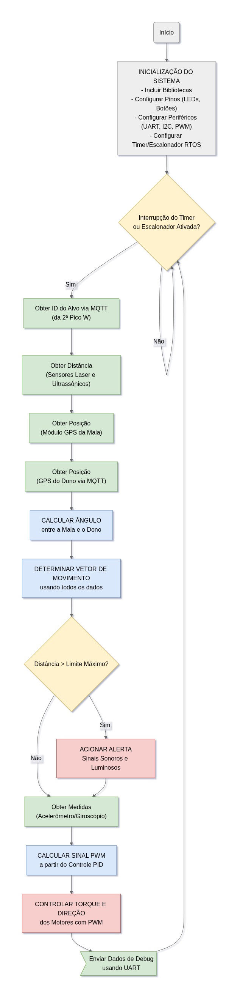

# Proposta de Arquitetura do Sistema para Mala Autônoma

## Objetivo
Apresentar a proposta de arquitetura do sistema, incluindo o diagrama de hardware, os blocos funcionais e o fluxograma do software.

## Diagrama de Blocos para Mala Autônoma

### Visão Geral
O projeto de mala autônoma utiliza a placa BitDogLab com uma Raspberry Pi Pico W como controlador central. Uma segunda Raspberry Pi Pico W lida com a detecção de identidade baseada em câmera usando TinyML.

### Componentes
- **Raspberry Pi Pico W - BitDogLab**: Hub central para processamento de dados de sensores e controle de motores.
- **Câmera (OV2640)**: Conectada à segunda Pico W para captura de imagens e processamento com TinyML, se comunica com a BitDogLab via MQTT.
- **LEDs (RGB)**: GPIOs 11, 12, 13 para feedback visual.
- **Buzzer**: GPIO 21 para alertas sonoros.
- **Sensor Capacitivo (TTP223B)**: GPIO 4 para detecção de toque na alça.
- **Dispositivos I2C (I2C0 - GPIOs 0, 1)**:
  - Acelerômetro/Giroscópio (MPU6050)
  - Sensor de Distância (VL53L0X)
  - Amplificador de Áudio (MAX98357) com mini alto-falantes
- **Sensor Ultrassônico (HC-SR04)**: GPIOs 2, 3 para detecção de proximidade.
- **Módulo GPS**: UART1 (GPIOs 8, 9) para rastreamento de localização.
- **Ponte H (TB6612FNG)**: GPIOs 18, 19, 20, 4, 16, 17, 28 para controlar dois motores DC (3-6V).
- **Fonte de Energia**:
  - Bateria de lítio 3,7V para ambas as Pico Ws.
  - Bateria de lítio 7,4V para Ponte H e motores.

### Comunicação
- MQTT para troca de dados entre as duas Pico Ws (dados da câmera e identidade).
- UART para interface de usuário e transmissão de dados.
- I2C para comunicação e configuração de vários sensores.

## Diagrama de Hardware para Mala Autônoma
![diagrama de hardware][smart_suitcase_fritzing.jpg]

### Visão Geral
A configuração de hardware gira em torno da Raspberry Pi Pico W dentro da placa BitDogLab, integrando vários sensores, atuadores e fontes de energia para operação autônoma.

### Conexões de Hardware
- **Raspberry Pi Pico W - BitDogLab**: Controlador central.
- **Segunda Raspberry Pi Pico W**: Conectada via MQTT, hospeda a câmera OV2640 para processamento com TinyML.
- **LEDs (RGB)**: GPIOs 11, 12, 13.
- **Buzzer**: GPIO 21.
- **Sensor Capacitivo (TTP223B)**: GPIO 4.
- **Dispositivos I2C (I2C0 - GPIOs 0, 1)**:
  - MPU6050 (Acelerômetro/Giroscópio)
  - VL53L0X (Sensor de Distância)
  - MAX98357 (Amplificador de Áudio) com mini alto-falantes de 0,5W
- **Sensor Ultrassônico (HC-SR04)**: GPIOs 2, 3.
- **Módulo GPS (GY-NEO6MV2)**: UART1 (GPIOs 8, 9).
- **Ponte H (TB6612FNG)**: GPIOs 18, 19, 20, 4, 16, 17, 28, controla dois motores DC de 3-6V.
- **Energia**:
  - Bateria de lítio 3,7V para as Pico Ws.
  - Bateria de lítio 7,4V para Ponte H e motores.

### Distribuição de Energia
- Bateria de 3,7V alimenta diretamente as Pico Ws.
- Bateria de 7,4V abastece a Ponte H para operação dos motores.

## Fluxograma para Software da Mala Autônoma

### Visão Geral
O fluxograma de software delineia a lógica de controle para a mala autônoma, iniciada por uma interrupção de temporizador ou escalonador RTOS na Raspberry Pi Pico W da BitDogLab.

### Etapas
1. **Inicialização do Sistema**:
   - Incluir bibliotecas necessárias.
   - Configurar UART para interface de usuário.
   - Configurar pinos de LEDs e botões.
   - Configurar UART para módulo GPS.
   - Configurar PWM para buzzer ou mini alto-falantes.
   - Configurar PWM para motores DC.
   - Configurar I2C para acelerômetro, sensor de distância e amplificador de áudio.
   - Configurar interrupção de temporizador ou escalonador RTOS.
2. **Gatilho de Interrupção**:
   - Verificar ativação por interrupção de temporizador ou escalonador RTOS.
3. **Loop de Processamento** (se interrupção ocorrer):
   - Obter identidade da câmera via MQTT (da segunda Pico W).
   - Recuperar posição do módulo GPS.
   - Buscar posição GPS do celular do dono via MQTT.
   - Calcular ângulo entre as posições GPS do dono e da mala.
   - Determinar vetor de movimento usando todos os dados coletados.
   - Verificar se a distância excede o limite máximo; emitir sinais sonoros e luminosos se verdadeiro.
   - Obter medições do acelerômetro/giroscópio.
   - Gerar sinal PWM usando controle PID.
   - Controlar torque e direção dos motores com PWM.
   - Enviar dados via UART.
4. **Retorno ao Temporizador**: Voltar para aguardar a próxima interrupção.

### Notas
- O sistema pausa o seguimento quando o sensor capacitivo detecta toque na alça.
